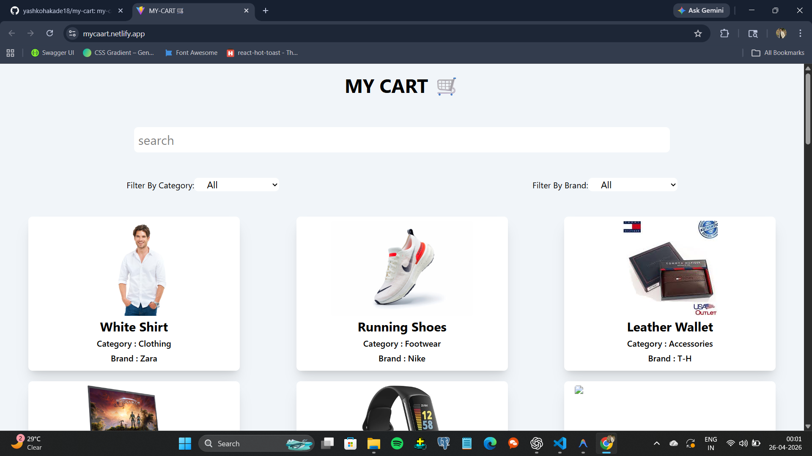

# React + Vite

# 🛒 MyCaart – E-commerce Web Application

🔗 **Live Demo:** https://mycaart.netlify.app/

MyCaart is a responsive and user-friendly e-commerce web application designed to provide a smooth online shopping experience. Users can browse products, manage their cart, and interact with a clean and modern interface.

---

## 🚀 Features

- 🛍️ Product listing with clean UI  
- 🔎 Search and filtering functionality  
- 🛒 Add to Cart / Remove from Cart  
- 💰 Dynamic pricing updates  
- 📱 Fully responsive design (Mobile + Desktop)  
- ⚡ Fast and optimized performance  

## Home Page :


## 🛠️ Tech Stack

- **Frontend:** HTML, CSS, JavaScript  
- **Styling:** CSS (Add Bootstrap/Tailwind if used)  
- **Deployment:** Netlify  


## 📂 Installation & Setup

```bash
git clone https://github.com/your-username/mycaart.git
cd mycaart
